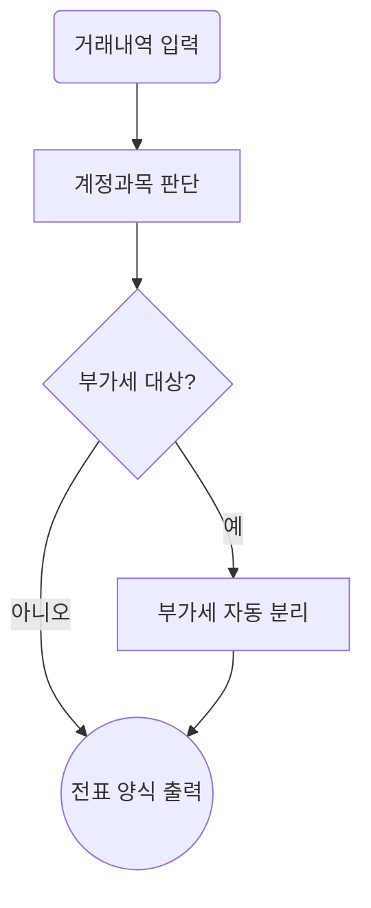

# 🎨 FlowBuilder — 업무 흐름도 → Mermaid 코드 자동 생성

> 도형 4종(▭▢◇⬭)과 화살표로 업무 흐름을 디지털로 그리면 **Mermaid flowchart 코드를 자동 생성**해주는 단일 페이지 웹앱.
> 종이·펜 없이 바로 만들고, 완성하면 **mermaid.live에 1초 만에 옮길 수 있습니다**.

**Live**: https://baikhojun.github.io/flow-builder/

📘 **유신엔지니어링 AI 활용 2차 TF 2회차** (2026-06-02) 2교시 실습용으로 제작되었습니다.

---

## 🎯 무엇이 다른가?

| | Draw Toast (기존) | FlowBuilder (이 게임) |
|---|---|---|
| 출력 | PNG·갤러리 | **Mermaid 코드 + PNG + .md** |
| 도형 | 카드(이모지) | **flowchart 4종 (rect·round·diamond·circle)** |
| 다음 단계 | 토론·비교 | **mermaid.live 1클릭 이동** |
| 자동 진단 | 사고 유형 8타입 | **flowchart 자동화 적합도 5기준** |

---

## 🚀 빠른 시작

1. https://baikhojun.github.io/flow-builder/ 접속
2. 닉네임(예: `회계_백호준`) + 타이머 20분 → **시작**
3. 좌측 **도형 4종 + 부서별 빠른 라벨**에서 클릭 → 캔버스에 추가
4. 도형 **더블클릭** → 텍스트 입력
5. **🔗 연결모드** ON → 도형 A 클릭 → 도형 B 클릭 → 화살표 자동
6. 화살표 클릭 → 라벨 입력 (예/아니오 등)
7. **우측 패널의 Mermaid 코드가 실시간 생성**
8. **📋 Mermaid 코드 복사** → **🌐 mermaid.live 열기** → Ctrl+V → 끝

---

## 🔷 도형 4종 (Mermaid 노드 모양과 1:1)

| 도형 | Mermaid | 용도 | 예시 |
|:---:|:---|---|---|
| **▭ 과정** | `A[텍스트]` | 일반 작업·처리 | 계정과목 판단, 부가세 분리 |
| **▢ 시작/끝** | `A(텍스트)` | 흐름의 시작·종료·문서 | 거래내역 입력, 회계 마감 |
| **◇ 판단** | `A{텍스트}` | "예/아니오" 분기 | 부가세 대상? |
| **⬭ 데이터** | `A((텍스트))` | 결과물·산출물·파일 | 전표 양식 출력 |

---

## ⚡ 부서별 빠른 라벨

좌측 하단 탭에서 부서를 선택하면 7개 라벨이 1클릭으로 도형+텍스트 추가:

- 🏢 **회계부** — 거래내역 → 전표 분개 (7노드)
- 🏢 **기획실** — 부서별 보고 → 사장단 요약 (7노드)
- 🏢 **총무부** — 채용 정보 → 공고 본문 (7노드)
- 🏢 **업무부** — 사업 정보 → 견적서 양식 (7노드)
- 🌐 **공통** — 입력 → 처리 → 출력 (7노드)

---

## 🤖 자동 생성 Mermaid 코드 예시

도형 5개 + 화살표 4개를 그리면 우측 패널에 즉시:



이 코드를 그대로 **mermaid.live**에 붙여넣으면 흐름도 그림이 됩니다.

---

## ✨ 풀버전 기능

- ✅ **도형 4종 + 화살표 + 라벨**
- ✅ **실시간 Mermaid 코드 미리보기**
- ✅ **📋 코드 복사 + 🌐 mermaid.live 1클릭 이동**
- ✅ **💾 PNG 다운로드** (Yooshin 폰트 임베드)
- ✅ **💾 .md 파일 저장** (Mermaid 코드 포함)
- ✅ **🖼 갤러리** — localStorage에 최대 30개 저장
- ✅ **⚖ 두 작품 비교** — 도형 종류·연결 수 자동 분석
- ✅ **자동 진단 5기준** — 노드 수·시작끝·연결·분기 비율·라벨 충실도

---

## 📚 자동 진단 5기준

완성 시 자동 진단:

| # | 기준 | 점수 |
|:---:|---|:---:|
| ① | 노드 수 5~8개 적정 | 2점 |
| ② | ▢ 시작/끝 1개 이상 | 2점 |
| ③ | 화살표 충분 (도형 수 - 1 이상) | 2점 |
| ④ | ◇ 판단 비율 30% 이하 | 1점 |
| ⑤ | 라벨 충실도 80% 이상 | 2점 |
| **합계** | | **9점** |

- 🥇 우수 (8~9점): 자동화 사양으로 바로 쓸 수 있음
- 🥈 양호 (6~7점): 3교시 1차 프롬프트 준비 완료
- 🥉 통과 (4~5점): 흐름 잡힘, 다듬으면 좋음
- 🔄 다시 (0~3점): 조금 더 채워보기

---

## 🎓 2회차 2교시 사용 시나리오

1교시(자동화 후보 발굴)에서 고른 본인 업무 후보 1개를 흐름도로:

```
시작 (도형: ▢ 시작/끝)
  ↓
받는 것 (도형: ⬭ 데이터)
  ↓
판단·계산 (도형: ▭ 과정 × 2~3개)
  ↓
분기 (도형: ◇ 판단, 선택)
  ↓
출력 (도형: ⬭ 데이터)
  ↓
끝 (도형: ▢ 시작/끝)
```

→ **5~8 도형이면 충분**합니다.
→ 완성 후 **📋 Mermaid 코드 복사** → 3교시 1차 프롬프트 작성의 입력으로 사용.

---

## 🛠 기술 스택

- **순수 HTML + CSS + JavaScript** (외부 라이브러리 0)
- SVG 캔버스 + localStorage 갤러리
- 한글 폰트: Yooshin Bold/Medium (PNG 임베드)
- Mermaid 변환: 자체 구현 (단순 노드·엣지 변환)

---

## 📜 출처·기여

- **기반**: [Draw Toast](https://github.com/Baikhojun/draw-toast) by WhiteJune (Tom Wujec의 Draw Toast 워크샵을 디지털화한 게임)
- **확장**: 정보시스템실 — 도형 4종 + Mermaid 변환 + 부서별 빠른 라벨 + 자동 진단 5기준

draw-toast의 캔버스·드래그·연결·갤러리·내보내기 모듈을 그대로 활용했습니다.

## 📄 License

MIT (draw-toast와 동일)
